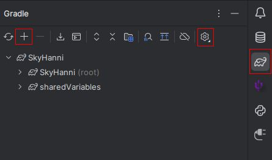
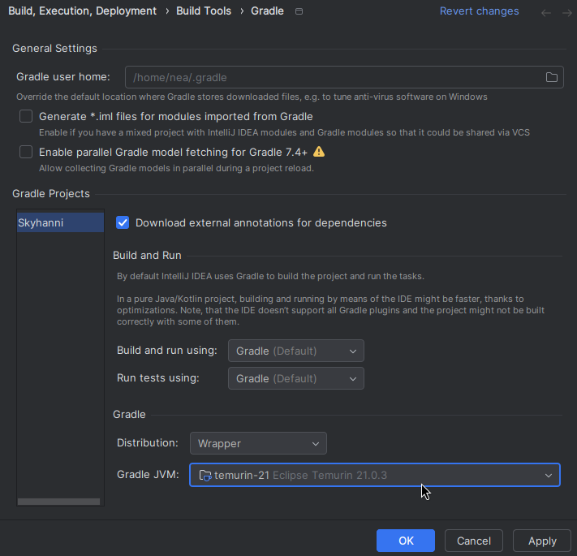
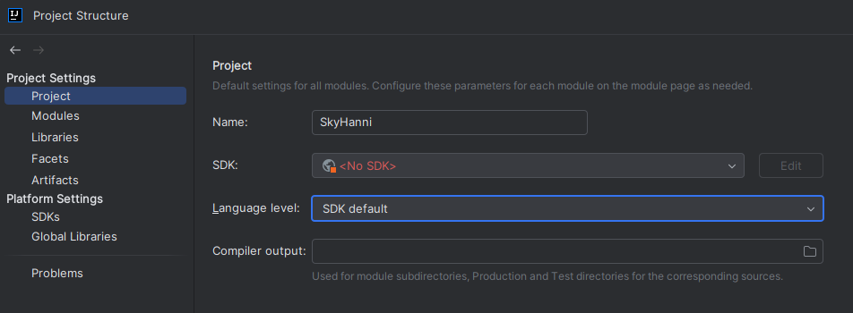
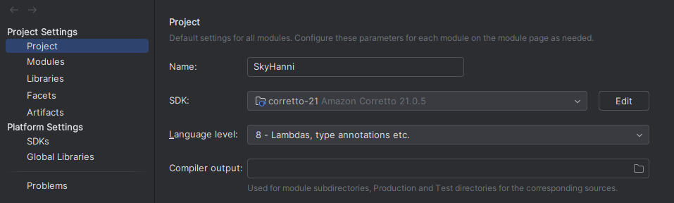
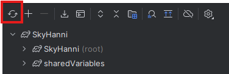
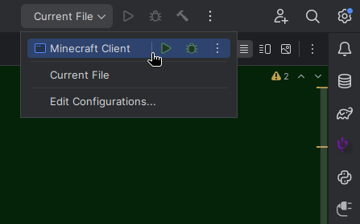

# How to Contribute

This is a technical guide that helps Kotlin and Java developers understand how SkyHanni works, and provides the first
steps for new Fabric developers to take.

## Development Environment Setup

When making changes to the code, it is recommended to use an IDE for live debugging and testing.
This tutorial explains how to set up the development environment for SkyHanni.
We use [IntelliJ](https://www.jetbrains.com/idea/) as an example.

### Download IntelliJ

- Download IntelliJ from the [JetBrains Website](https://www.jetbrains.com/idea/download/).
    - Use the Community Edition. (Scroll down a bit.)

### Cloning the project

- Create an account on GitHub
    - Go to https://github.com/hannibal002/SkyHanni
    - Click on the fork button to create a fork.
        - Leave the settings unchanged
        - Click on `create fork`
    - Open IntelliJ
        - Link the GitHub account with IntelliJ.
        - Install Git in IntelliJ.
        - In IntelliJ, go to `new` → `project from version control`.
        - Select `SkyHanni` from the list.
        - Open the project.

### Setting up IntelliJ

Once your project is imported into IntelliJ from the previous step, all dependencies like Minecraft, NEU, and so on should be automatically
downloaded. If not, you might need to link the Gradle project in the Gradle tab (little elephant) on the right.

🖼️Show Gradle tab image

If importing fails, make sure the Gradle JVM (found in the settings wheel in the Gradle tab, or by searching <kbd>Ctrl + Shift + A</kbd>
for "Gradle JVM") is set to a Java 21 JDK.

🖼️Show Gradle JVM image

Now that gradle is done importing (which might take a few minutes the first time you download the project) we want to set up the java version for the project.

To do this we press `(CTRL+ALT+SHIFT+S)` in IntelliJ, or go to `File` → `Project Structure...`.

🖼️ What the project structure will look like originally

We want to set the project structure to use Java 21.

🖼️ What you should set the project structure to be

Finally, we then want to reload gradle which can be done from the gradle tab from earlier.

🖼️ Show Gradle reload button

After all importing is done (which should be much quicker this time), you should find a new IntelliJ run
configuration. If not, you can restart intellij and reload the gradle project again.

🖼️Show run configuration selection image

Select an appropriate Java 21 JDK (preferably [DCEVM](#hot-swap), but any Java 21 JDK will do).

🖼️Show run configuration image

Now that we are done with that, you should be able to launch your game from your IDE with that run configuration.

SkyHanni's Gradle configuration is very similar to the one used in **NotEnoughUpdates**, so if you want to look at another guide, check
out [their guide](https://github.com/NotEnoughUpdates/NotEnoughUpdates/blob/master/CONTRIBUTING.md).

## Pull Requests

General infos about Pull Request can be found on
the [GitHub Docs](https://docs.github.com/en/pull-requests/collaborating-with-pull-requests/proposing-changes-to-your-work-with-pull-requests).

### Creating a Pull Request

If you are not very familiar with git, you might want to try this out: https://learngitbranching.js.org/.

Proposed changes are best made in their own branch, as this makes development easier for both you and the maintainers of this repository.
You can do this by following the instructions within the IntelliJ window in the open SkyHanni project:

- Click the beta dropdown at the top of IntelliJ.
- Click **New branch**.
- Give the branch a name related to the changes you plan to make.

_A more in-depth explanation of how to use IntelliJ and branches will follow someday._

### Guidelines for Pull Requests

Please use a prefix for the PR name (e.g., Feature, Improvement, Fix, Backend, etc.).

When writing the PR description, ensure you fill out the template with all the necessary information.
In the **What** section, write technical details or explanations that don't belong in the changelog.
Including that field is optional for small changes.

If your PR relies on another PR, please include this information at the beginning of the description. Use the format `- #<pr number>`
for the dependency, or `- <url>` for REPO dependencies.

### Changelog Builder

The PR description is processed by our [ChangeLog Builder](https://github.com/SkyHanniStudios/SkyHanniChangelogBuilder).

- Follow the format examples from the template and remove the categories that do not apply to your PR.
- A PR might include multiple changelog categories simultaneously.

Here is an explanation of which changes belong to each category:

#### New Features

New standalone features that are independent of existing features. Additional settings for existing features belong in the **Improvements**
category.

#### Improvements

Changes that improve or expand the code's logic and have a visible impact on users. This category is for enhancements, not for fixing
incorrect logic.
The line between bug fixes and improvements is sometimes not clear. If you are unsure whether a change is an improvement or a bug fix, ask
for guidance.

#### Fixes

Bug fixes, including typos (only those visible to the user, e.g., in config or chat messages), missing checks that cause incorrect behavior
under specific conditions, or logic errors.
Only significant performance issues are considered bugs; otherwise, they fall under **Technical Details**. If the code does not behave as
intended by the original developer, it is a bug. If the original code had logical errors, it is a bug. If the original code lacks nuance but
is not incorrect, it is not a bug.

#### Technical Details

Internal changes that do not impact the end user. Examples include:

- Refactoring (renaming or moving members, functions, classes, files or packages)
- Typos in object names (which the end user will not see)
- API updates
- Minor performance improvements
- Documentation changes to markdown files, e.g., in `/docs` or this file.

Try to avoid using this when the main goal of the PR is a user facing change, and the included backend change is related to that change.
We mostly only need standalone changes or big/relevant backend changes marked as Technical Details,
everything else can go in the normal PR description (What area).

#### Removed Features

Features that have merged with existing features (in the config) or have become obsolete (e.g., if Hypixel implements them on the server
side).

#### No category

Some changes don't fit any categories.
E.g. when reverting pull requests or doing quick fixes to PRs merged immediately beforehand but not yet released in a beta.
To tell the changelog build this, write either `exclude_from_changelog` or `ignore_from_changelog` in one line.
Make sure such pull requests have a good explanation in the **What** section.

## Coding Styles and Conventions

- Follow the [Hypixel Rules](https://hypixel.net/rules).
- Use the coding conventions for [Kotlin](https://kotlinlang.org/docs/coding-conventions.html)
  and [Java](https://www.oracle.com/java/technologies/javase/codeconventions-contents.html).
- **My build is failing due to `detekt`, what do I do?**
    - `detekt` is our code quality tool. It checks for code smells and style issues.
    - If you have a build failure stating `Analysis failed with ... weighted issues.`, you can
      check `build/reports/detekt/` for a comprehensive list of issues.
    - **There are valid reasons to deviate from the norm**
        - If you have such a case, either use `@Supress("rule_name")`, or re-build the `baseline-main.xml` file,
          using `./gradlew detektBaselineMain`.
- Do not copy features from other mods. Exceptions:
    - Mods that are paid to use.
    - Mods that have reached their end of life. (Rip SBA, Dulkir and Soopy).
    - The mod has, according to Hypixel rules, illegal features ("cheat mod/client").
    - If you can improve the existing feature in a meaningful way.
- All new classes should be written in Kotlin, with a few exceptions:
    - Config files in `at.hannibal2.skyhanni.config.features`
    - Mixin classes in `at.hannibal2.skyhanni.mixins.transformers`
- New features should be made in Kotlin objects unless there is a specific reason for it not to.
    - If the feature needs to register Fabric events, uses SkyHanni events or creates repo patterns, annotate the feature class with `@SkyHanniModule`
    - This will automatically register all events to the respective event bus, and loads the repo patterns.
    - In the background, this will create a new file `LoadedModules.kt` when compiling. Please ignore this file and the related error
      in `SkyHanniMod.kt`.
- Avoid using deprecated functions.
    - These functions are marked for removal in future versions.
    - If you're unsure why a function is deprecated or how to replace it, please ask for guidance.
- Future JSON data objects should be made in kotlin and placed in the directory `at.hannibal2.skyhanni.data.jsonobjects`
- Config files should be made in **Kotlin**.
    - There may be legacy config files left as Java files, however they will all be ported eventually.
- Please use the existing event system, or expand on it.
    - To expand the event systems you can create a new event that is called from a Mixin
    - Or you can subscribe to a Fabric event and then post a SkyHanni event from that. See the `api/minecraftevents` package for examples.
    - If you make a new event there are a few different types of events that you can make, make sure your event extends one of these.
        - SkyHanniEvent: This is just a normal event.
        - CancelableSkyHanniEvent: This is a cancellable event. It has a `cancel()` method that you can call to cancel the event.
        - GenericSkyHanniEvent: This is a generic event, typically used for entities but can be used for any generics.
        - RenderingSkyHanniEvent: This is an event that you are allowed to do GUI rendering in.
- Please use existing utils methods.
- We try to avoid calling the NEU code too often.
    - (We plan to remove NEU as a dependency in the future.)
- Never use  `System.currentTimeMillis()`. Use our own class `SimpleTimeMark` instead.
    - See [this commit](https://github.com/hannibal002/SkyHanni/commit/3d748cb79f3a1afa7f1a9b7d0561e5d7bb284a9b)
      as an example.
- Try to avoid using Kotlin's `!!` (catch if not null) feature.
    - Replace it with `?:` (if null return this).
    - This will most likely not be possible to avoid when working with objects from java.
- Don't forget to add `@FeatureToggle` to new standalone features (not options to that feature) in the config.
- Do not use `e.printStackTrace()`, use `ErrorManager.logErrorWithData(error, "explanation for users", ...extraOptionalData)` instead.
- Do not use `event.post()` directly for Fabric events, use the SkyHanni event system instead.
- Do not use `toRegex()` or `toPattern()`, use `RepoPattern` instead.
  -
  See [RepoPattern.kt](https://github.com/hannibal002/SkyHanni/blob/beta/src/main/java/at/hannibal2/skyhanni/utils/repopatterns/RepoPattern.kt)
    - All repo patterns must be accompanied by a regex test. Look at other patterns for examples, more information and usages.
    - The pattern variables are named in the scheme `variableNamePattern`
- Please use Regex instead of String comparison when it is likely Hypixel will change the message in the future.
- Do not use `fixedRateTimer` when possible and instead use `SecondPassedEvent` to safely execute the repeating event on
  the main thread.
- When updating a config option variable, use the `ConfigUpdaterMigrator.ConfigFixEvent` with event.move() when moving a value, and
  event.transform() when updating a
  value. [For Example](https://github.com/hannibal002/SkyHanni/blob/e88f416c48f9659f89b7047d7629cd9a1d1535bc/src/main/java/at/hannibal2/skyhanni/features/gui/customscoreboard/CustomScoreboard.kt#L276).
- Use American English spelling conventions (e.g., "color" not "colour").
- When creating/updating a command, move it out of the `Commands.kt` class, if it isn't already, into the class that it belongs to.
- Avoid direct function imports. Always access functions or members through their respective namespaces or parent classes to improve
  readability and maintain encapsulation.
- Follow Kotlin conventions for acronym naming:
    - Use all-uppercase for two-letter acronyms (e.g., `XP`).
    - Treat three or more letter acronyms as regular words with only the first letter capitalized (e.g., `Api`).
- Always combine title messages with chat message.
    - This way users know what feature and what mod sends the title, if they want to disable it.
    - Also we can include more informations why the title just showed up, as the title should not be too long.

## Additional Useful Development Tools

### DevAuth

[DevAuth](https://github.com/DJtheRedstoner/DevAuth) is a tool that allows logging in to a Minecraft account while
debugging in IntelliJ. This is very useful for coding live on Hypixel without the need to compile a jar.

- The library is already downloaded by Gradle.
- SkyHanni will automatically set up DevAuth.
- Start Minecraft inside IntelliJ normally.
    - Click on the link in the console and verify with a Microsoft account.
    - The verification process will reappear every few days (after the session token expires).

### Hot Swap

Hot Swap allows reloading edited code while debugging, removing the need to restart the whole game every time.

We use [dcevm](https://dcevm.github.io/) and the IntelliJ
Plugin [HotSwap Agent](https://plugins.jetbrains.com/plugin/9552-hotswapagent) to quickly reload code changes.

### [Live Plugin](https://plugins.jetbrains.com/plugin/7282-liveplugin)

Allows project specific plugins to run. Eg: Regex Intention

### [Live Templates Sharing](https://plugins.jetbrains.com/plugin/25007-live-templates-sharing)

Imports our custom live templates automatically. Live Templates allow for quicker code writing.

### [Minecraft Development](https://plugins.jetbrains.com/plugin/8327-minecraft-development)

Helps you write minecraft specific code such as mixins and access wideners.

## Software Used in SkyHanni

### Basics

SkyHanni is a Fabric mod for Minecraft 1.21.5+, written in [Kotlin](https://kotlinlang.org/)
and [Java](https://www.java.com/en/).

We use a [Gradle configuration](https://gradle.org/) to build the mod,
written in [Kotlin DSL](https://docs.gradle.org/current/userguide/kotlin_dsl.html):
[build.gradle.kts](https://github.com/hannibal002/SkyHanni/blob/beta/build.gradle.kts)

This start script will automatically download all required libraries.

### NotEnoughUpdates

SkyHanni requires **[NotEnoughUpdates](https://github.com/NotEnoughUpdates/NotEnoughUpdates/)**.
We use NEU to get auction house and bazaar price data for items and to read
the [NEU Item Repo](https://github.com/NotEnoughUpdates/NotEnoughUpdates-REPO) for item internal names, display names
and recipes.

### Config

SkyHanni stores the config (settings and user data) as a json object in a single text file.
For rendering the /sh config (categories, toggles, search, etc.),
SkyHanni uses **[MoulConfig](https://github.com/NotEnoughUpdates/MoulConfig)**, the same config system as NotEnoughUpdates.

### Elite Farmers API

SkyHanni utilizes the [Elite API](https://api.elitebot.dev/) (view the [public site here](https://elitebot.dev)) for
some farming features.

This includes features relating to Farming Weight, as well as syncing jacob contests amongst players for convenience.
All data sent is anonymized and opt-in.

### Mixin

A system to inject code into the original Minecraft code.
This library is not part of SkyHanni or Fabric, but we bundle it.

It allows to easily modify methods in Minecraft itself, without conflicting with other mods.

For more information, see https://github.com/SpongePowered/Mixin
or [our existing mixins](https://github.com/hannibal002/SkyHanni/tree/beta/src/main/java/at/hannibal2/skyhanni/mixins/transformers).

When creating new Mixins, try to keep the code inside the mixin as small as possible, and calling a hook as soon as
possible.

### Repo

SkyHanni uses a repo system to easily change static variables without the need for a mod update.
The repo is located at https://github.com/hannibal002/SkyHanni-REPO.
A copy of all json files is stored on the computer under `.minecraft\config\skyhanni\repo`.
On every game start, the copy gets updated (if outdated and if not manually disabled).
If you add stuff to the repo make sure it gets serialised. See
the [JsonObjects](src/main/java/at/hannibal2/skyhanni/data/jsonobjects/repo)
folder for how to properly do this. You also may have to disable repo auto update in game.

### Discord IPC

DiscordIPC is a service that SkyHanni uses to send information from SkyBlock to Discord in Rich Presence.  
For info on usage, look
at [DiscordRPCManager.kt](https://github.com/hannibal002/SkyHanni/blob/beta/src/main/java/at/hannibal2/skyhanni/features/misc/discordrpc/DiscordRPCManager.kt)

### Auto Updater

We use the [auto update library](https://github.com/nea89o/libautoupdate) from nea89.

### Discord Bot

While not directly part of the Minecraft mod, it is useful to know that we have
a [Discord Bot](https://github.com/SkyHanniStudios/DiscordBot) that helps with small tasks related to PRs.

## Access Wideners

You may want to use private minecraft methods or fields, this is where access wideners come in.
Access wideners are a way to access private methods and fields in Minecraft classes. They are used to modify the access level of a method or
field and allow it to be accessed from other classes. This is an easier alternative to using mixins and making an accessor.
To get an access widener entry, you can use the Minecraft Development plugin for IntelliJ. Then you can right-click on a method or field and
select `Copy / Paste Special` -> `AW Entry` and paste this into the bottom
of `src/main/resources/skyhanni.accesswidener`.
Then you need to reload gradle for the changes to apply.

This requires you to have the Minecraft Development plugin installed as mentioned earlier.
